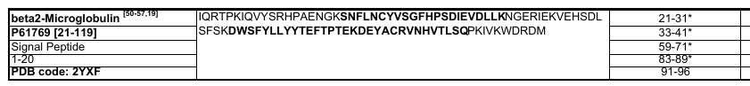

```{r setup, include=FALSE}
knitr::opts_chunk$set(echo = TRUE)
source("./functions/benchmark_functions/reg33_benchmark_other.R")

add_nothing <- function(x)
  apply(matrix(c(x, rep("", (floor(length(x)/40) + 1)*40 - length(x))), ncol = 40,
         byrow = TRUE), 1, paste0, collapse = "")

```

## reg33

Sequences (text):  
Small letters - hot spots as indicated by indices in publication.  

Sequences (images):  
Bold text - hot spot.

### &beta;2-microglobulin



```{r beta, echo = FALSE, results='markup'}
cat(add_nothing(r33_lu[[17]]), sep = "  \n")
```

Image: GK**SN**  
Indices: GKS**N**  

Image: **LSQ**PKIVKWDRDM  
Indices: **LSQ**P**KIVKWD**RDM  

