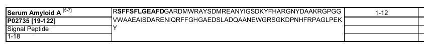

```{r setup, include=FALSE}
knitr::opts_chunk$set(echo = TRUE)
source("./functions/benchmark_functions/reg33_benchmark_other.R")
source("./functions/plot_tools.R")

library(DT)
options(DT.options = list(dom = "Brtip",
                          buttons = c("copy", "csv", "excel", "print")
))

add_nothing <- function(x)
  apply(matrix(c(x, rep("", (floor(length(x)/40) + 1)*40 - length(x))), ncol = 40,
         byrow = TRUE), 1, paste0, collapse = "")

```

## AmyLoad annotations

Problematic peptide (two annotations in AmyLoad): VTQEFW.

## reg33

The reg33 dataset is used to benchmark PASTA2, specifically to assess the ability to detect hot spots in the sequences of whole proteins. This dataset was published [along with AMYLPRED2](http://journals.plos.org/plosone/article?id=10.1371/journal.pone.0054175).  

```{r reg33, echo = FALSE, results='markup'}
library(scatterD3)

scatterD3(data = reg33_summary, x = prot_len, y = hs_len, col_var = hs_n,
          tooltip_text = reg33_summary[["prot_name"]],
          xlab = "Protein length", ylab = "Hot spot length", col_lab = "Number of hot spots", 
          xlim = c(0, max(reg33_summary[["prot_len"]])*1.05),
          ylim = c(0, max(reg33_summary[["hs_len"]])*1.05))
```

### Wrongly annotated sequences in reg33

The data from reg33 publication was annotated twice regarding the position of hot spots. We compared two annotations and found only one protein where two annotations are not in the agreement.  

Sequences (text):  
Small letters - hot spots as indicated by indices in publication.  

Sequences (images):  
Bold text - hot spot.

#### Serum Amyloid A



```{r serum, echo = FALSE, results='markup'}
cat(add_nothing(r33_lu[[5]]), sep = "  \n")
```

Image: **RSFF**  
Indices: R**SFF**  

#### &beta;2-microglobulin


```{r beta, echo = FALSE, results='markup'}
cat(add_nothing(r33_lu[[17]]), sep = "  \n")
```

Image: GKS**N**  
Indices: GK**SN**  

Image: **LSQ**PKIVKWDRDM  
Indices: **LSQ**P**KIVKWD**RDM  
  
### reg33 vs AmyLoad  

```{r reg33vAmyLoad_pivot, echo = FALSE,results='asis'}
pivot_table <- as.data.frame(table(reg33_al_comp[, c("AmyLoad_et", "reg33_et")]), responseName = "Count")
kable(pivot_table)
```

`r sum(pivot_table[["Count"]])` peptides from AmyLoad are subsequences of proteins in reg33. `r sum(pivot_table[c(1, 4), "Count"])` peptides have the same annotation in both datasets and the rest (`r sum(pivot_table[-c(1, 4), "Count"])`) have different annotations. The "Mixed" annotation means that in a peptide according to reg33 only a part of residues belongs to a hot spot.

```{r reg33vAmyLoad, echo = FALSE}
datatable(reg33_al_comp, escape = FALSE, extensions = 'Buttons', 
            filter = "top", rownames = FALSE) %>% 
  formatRound("CI", digits = 4)
```

CI is concordance index, a difference of the average status of a protein in reg33 and a status in AmyLoad database. CI equal to 0 means that the sequences in both datasets have the same etiquette (amyloids/nonamyloid). CI equal to 1 means that a sequence has totally oppossed etiquettes. CI larger than 0.5 means that the bigger part of the sequence described in reg33 has the different annotation than in the AmyLoad database.

`r sum(reg33_al_comp[["CI"]] > 0.5)` sequences (`r round(sum(reg33_al_comp[["CI"]] > 0.5)/length(seqs_list) * 100, 2)`%) in the AmyLoad database have drastically different annotations than in the reg33 dataset.

## Performance of AmyloGram on reg33

```{r AG_general, echo = FALSE}
ggplot(reg33_full_preds, aes(x = as.factor(len), y = AUC, fill = reverted)) +
  geom_bar(stat = "identity") +
  coord_cartesian(ylim = c(0.5, 1)) +
  my_theme
```

```{r AG_specific, echo = FALSE}
ggplot(reg33_full_preds, aes(x = len, y = AUC, color = reverted)) +
  geom_point(size = 5) +
  facet_wrap(~ hs_mean_len_d, nrow = 1) +
  geom_hline(data = group_by(reg33_full_preds, hs_mean_len_d) %>% 
               summarise(mAUC = mean(AUC)),
             aes(yintercept = mAUC), linetype = "dashed") +
  my_theme
```